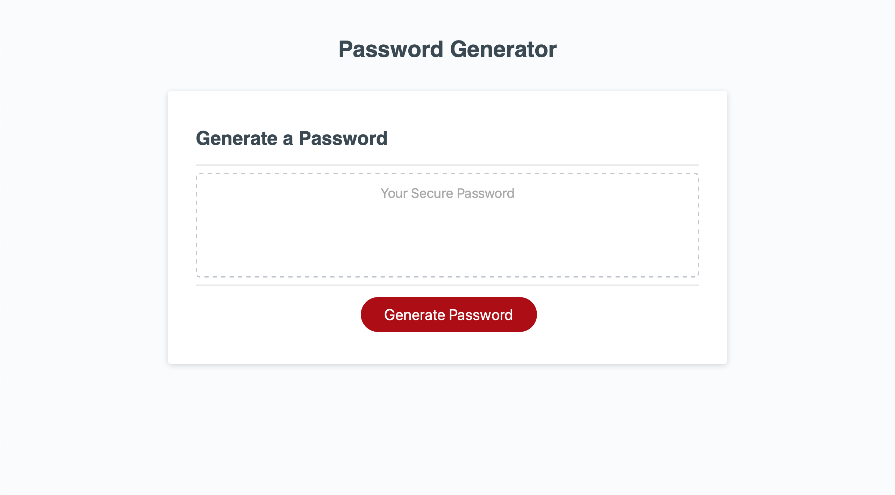

# Random Personal Password Generator
By Carly Jackson

# Description
The Random Personal Password Generator is a computer generated code that creates a unique password for online users. The generator provides each user a series of five prompts giving them the ability to determine the length of their password, wether the password will include uppercase and/or lowercase letters, numerical digits, and/or special characters. Each password generated is absolutely random and therefore, individual for each user.

# Link
# Link to My GitHub Repository Webpage
https://github.com/caarlyjackson/generate-a-personal-password

# Link to Random Personal Password Generator Webpage
https://caarlyjackson.github.io/generate-a-personal-password/

# Screen Shot
